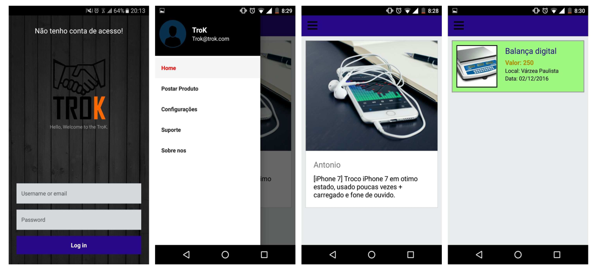

<h1 align="center">TroK Project</h1>
<h3 align="center">Repository Interdisciplinary Project 2B.</h3>

The project was developed in the 4th applied project of analysis and
system development, the application has the objective of easily and
exchange of non-profit consumer goods. Development is being
performing using React Native with the firebase platform. Unfortunately the
to contemplate access to all native mobile component, in this way we are faced with
the need to develop some native components and resources using Java
and Swify.
  

 

### PrintScreen

### Credits Authors

- Bruno Magalhães
- Filipe Natanael
- Bruno de Sousa
- Carlos Roberto de Oliveira
- Yan Trotta Soares.
