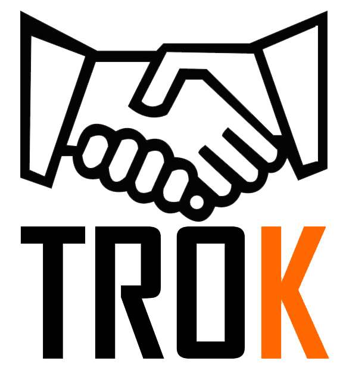

# PI2BADS

<h1 align="center">TroK Project</h1>
<h3 align="center">Repository Interdisciplinary Project 2B.</h3>

This project was built for the <b><i>Udacity React Nanodegree Program</i></b>. A bookshelf app that allows you to select and categorize books you have read, are currently reading, or want to read. The project emphasizes using React to build the application and provides an API server and client library that it should be persisted information as user’s interacts with the application.
  

 

The project was developed in the 4th applied project of analysis and
system development, the application has the objective of easily and
exchange of non-profit consumer goods. Development is being
performing using React Native with the firebase platform. Unfortunately the
to contemplate access to all native mobile component, in this way we are faced with
the need to develop some native components and resources using Java
and Swify. Our goal is to continue development in the next semester.

Credits: Bruno Magalhães, Filipe Natanael, Bruno de Sousa, Carlos Roberto de Oliveira, Yan Trotta
Soares.
